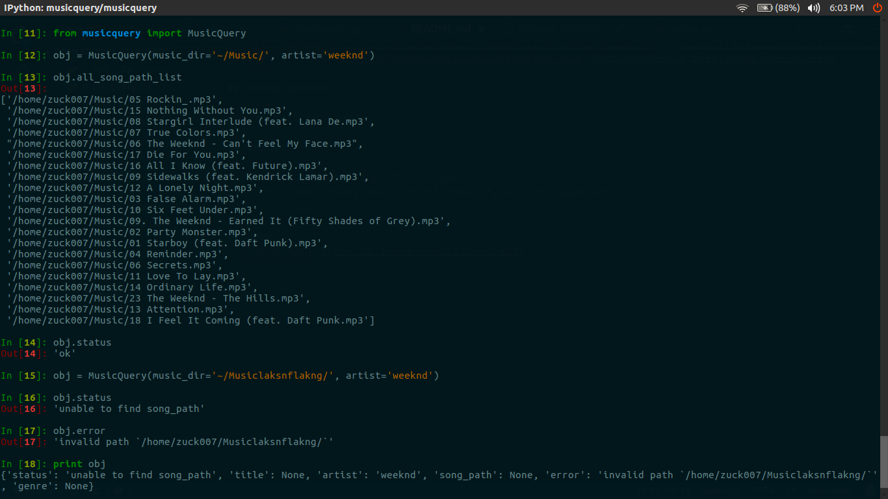

# musicquery

> A Python package which returns song_path after matching given query
with all existing songs in music_dir

[](https://raw.githubusercontent.com/zuck007/musicquery/master/LICENSE) 
[](https://badge.fury.io/py/musicquery)

## Installation
```
pip install musicquery
```
## Usage
```
>>> from musicquery import MusicQuery
>>> obj = MusicQuery(music_dir='~/Music', artist='weeknd')
>>> # when there are more than one song in `all_song_path_list` then it will select a random `song_path`
>>> obj.__dict__
  {'all_song_path_list': [
          '/home/zuck007/Music/05 Rockin_.mp3',
          '/home/zuck007/Music/15 Nothing Without You.mp3',
          '/home/zuck007/Music/08 Stargirl Interlude (feat. Lana De.mp3',
          '/home/zuck007/Music/07 True Colors.mp3',
          '/home/zuck007/Music/13 Attention.mp3',
          '/home/zuck007/Music/18 I Feel It Coming (feat. Daft Punk.mp3',
          .........
          ],
    'artist': u'The Weeknd',
    'error': None,
    'genre': u'R&B/Soul',
    'music_dir': '/home/zuck007/Music/',
    'song_path': '/home/zuck007/Music/03 False Alarm.mp3',
    'status': 'ok',
    'title': u'False Alarm'
    }
>>> obj = MusicQuery(music_dir='~/Music/', title='Fire')
>>> {'all_song_path_list': [
          '/home/zuck007/Music/Loyd Banks - On Fire.mp3',
          '/home/zuck007/Music/Lil Wayne - Fireman.mp3',
          '/home/zuck007/Music/22 P!NK - Just Like Fire (From Alice.m4a',
          '/home/zuck007/Music/03-eminem-on_fire.mp3'
          ],
     'artist': u'Lil Wayne',
     'error': None,
     'genre': 'Rap',
     'music_dir': '/home/zuck007/Music/',
     'song_path': '/home/zuck007/Music/Lil Wayne - Fireman.mp3',
     'status': 'ok',
     'title': u'Fireman'
     }
```
## Demo

